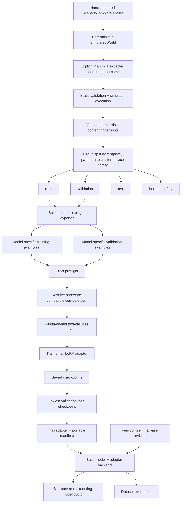
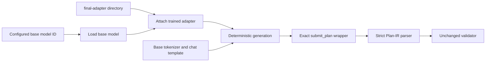

# Model Lifecycle

[Documentation home](README.md) | [Glossary](glossary.md)

This page owns the path from canonical scenario records to a trained adapter and measured model
behavior. For runtime authorization, read [Contracts and safety](contracts-and-safety.md). For the
plugin interface and artifact checks, read
[Model plugins, artifacts, and compute](model-plugins-and-compute.md).

## Purpose

The model lifecycle exists to improve proposal quality while preserving the runtime boundary. Training output is never executed directly. The selected adapter is loaded by the same planner backend and evaluated through the same strict parser and validator used by the unmodified base model.

## In plain language

1. We write small, reviewable examples of requests and correct plans.
2. The simulator proves that those plans are valid and produce the expected outcome.
3. Related examples are kept together so nearly identical wording cannot leak from training into evaluation.
4. Preflight checks the files and confirms that the tokenizer will not cut off the correct answers.
5. Supervised fine-tuning teaches a small adapter to produce the correct `submit_plan` call.
6. The best checkpoint is loaded back into the ordinary planner and judged by strict plan checks.

Supervised fine-tuning (SFT) means learning from known input/output examples. Low-Rank Adaptation (LoRA) means training a small adapter while leaving the original base-model weights frozen. Parameter-Efficient Fine-Tuning (PEFT) is the framework used to attach and load that adapter.

## End-to-end data and model flow



## Label provenance

Gold plans are not copied from a large language model (LLM). Each scenario declares its expected route and plan structure in code. Dataset generation then:

1. Builds a deterministic simulated device and capability cards.
2. Creates a request, state snapshot, policy, and explicit Plan IR.
3. Runs the plan through the real static validator.
4. Executes it through a `StaticPlanner` and the real coordinator when the route has local work.
5. Confirms the coordinator outcome.
6. Adds provenance metadata and a content fingerprint.

If a generated label is invalid or produces the wrong outcome, generation fails instead of writing the dataset.

## Split isolation

Records are grouped by:

```text
template_id | paraphrase_cluster | device_family
```

A group can appear in only one split. Safety-tagged groups are placed in the isolated safety split. This prevents a test result from merely measuring memorized paraphrases of a training scenario.

The current pilot distribution is:

| Split | Records | Scenario groups/routes |
| --- | ---: | --- |
| Train | 20 | Five groups covering local, clarify, defer, and external |
| Validation | 4 | One hybrid group |
| Test | 4 | One held-out local battery group |
| Safety | 8 | Deny scenarios for unsafe actuator requests and prompt injection |

This distribution is useful for pipeline validation but is not route-balanced model training.

## Canonical records and the FunctionGemma training export

The canonical records are model-neutral. During `generate-data`, each selected trainable plugin receives the same grouped splits and writes its own export. This allows another model to use a different chat template or structured-output syntax without changing gold Plan IR or evaluation groups.

Each supervised fine-tuning example is stored in JSON Lines (JSONL) format: one complete JavaScript Object Notation (JSON) object per line. It contains:

- `record_id`: must match the gold plan request ID.
- `group_id`: used for leakage detection.
- `expected_route`: must match the gold plan route.
- `messages`: developer message, compact user context, and one assistant tool call.
- `tools`: exactly the versioned synthetic `submit_plan(plan_json)` tool.

The user context contains the request, live state, policy, Plan-IR shape, constraints, and selected capability cards. The assistant target contains canonical Plan-IR JSON inside `submit_plan`.

## Preflight gates

`edge-delegate-lab train --preflight-only` loads both splits and refuses to continue when:

- a JSONL line is too large, empty, malformed, duplicated, or has duplicate object keys;
- the message role sequence or `submit_plan` tool differs from the versioned format;
- the target Plan IR does not parse;
- target request ID or route differs from record metadata;
- train/evaluation records overlap;
- train/evaluation scenario groups overlap;
- tokenizer rendering would exceed `max_length` and truncate any label.
- the assistant loss mask is empty, omits part of the FunctionGemma tool-call envelope, or does
  not end on the expected special-token boundary.

For the current FunctionGemma prompt, the measured maximum is 1,354 training tokens and 1,322 validation tokens, below the configured 2,048-token ceiling.

## Training-only chat-template mask

FunctionGemma's shipped tool-calling template does not include the generation markers required
for assistant-only loss by the Hugging Face TRL post-training library. The project adds markers
around the serialized assistant `tool_calls` block only during training. Jinja template markers
select tokens for loss; they do not change rendered inference text.

This keeps loss focused on the `submit_plan` call instead of teaching the model to reproduce the request, state, policy, or capability declarations. The base tokenizer template remains the inference template.

The FunctionGemma training targets contain tool calls rather than ordinary assistant prose. TRL
can therefore print a generic warning that an ordinary assistant end token is outside the loss
mask. The project does not accept or dismiss that message on faith: preflight inspects the actual
mask for every train and validation record and records `assistant_loss_mask` statistics in the
training report. Those explicit tool-call checks are the acceptance signal for this template.

## Low-Rank Adaptation configuration and checkpoint selection

The pilot configuration uses:

| Setting | Value |
| --- | --- |
| Base model | `google/functiongemma-270m-it` |
| Precision | Brain Floating Point 16-bit (BF16) |
| Attention backend | Eager, retained as the measured pilot baseline |
| Maximum process GPU-memory fraction | 0.88 |
| Adapter | Low-Rank Adaptation over all linear model modules |
| Rank / alpha / dropout | 16 / 32 / 0.05 |
| Max sequence length | 2,048 |
| Effective batch | 1 per device x 4 accumulation |
| Epochs | 8 |
| Learning rate | `5e-5`, constant |
| Selection metric | Lowest validation loss |
| Hub behavior | `push_to_hub=False` |

Rank controls how much adapter capacity is added: higher values add trainable parameters and memory cost. Alpha scales the adapter's contribution, while dropout randomly omits a small fraction of adapter activations during training to reduce overfitting. Gradient accumulation makes four one-example steps act like an effective batch of four without holding all four examples in GPU memory at once. `push_to_hub=False` means the trainer writes only to the local artifact directory and never uploads weights automatically.

The runner refuses to reuse a non-empty output directory. This prevents a new run from silently mixing checkpoints or logs with an older experiment.

## What is saved

```text
artifacts/training/<run>/
  checkpoint-*/             epoch checkpoints retained by save_total_limit
  final-adapter/            best adapter + tokenizer metadata
    edge-delegate-artifact.json
  training-run.json         reproducibility and measurement report
  runs/                     TensorBoard logs
```

`edge-delegate-artifact.json` binds the adapter to the selected plugin, exact base revision, plan protocol, tokenizer and adapter fingerprints, datasets, recipe, context limit, and precision.

`training-run.json` records configuration, base revision, train/evaluation fingerprints, preflight results, package versions, hardware inventory, resolved compute plan, peak allocated and reserved GPU memory, duration, best checkpoint/metric, parameter counts, and train/evaluation metrics.

Artifacts are intentionally ignored by Git. The configuration, generator, protocol, and code are tracked; machine-specific weights, paths, raw outputs, and logs are not.

## How an adapter reconnects to runtime



The lab Command-Line Interface selects the `functiongemma` plugin and passes `--adapter` through its versioned interface. The plugin verifies the portable manifest and file digests, pins the recorded base revision, attaches the adapter with Parameter-Efficient Fine-Tuning (PEFT), and returns a typed planner. Nothing in parsing, policy, validation, routing, or execution changes when an adapter is present.

## Model doctor versus full evaluation

The model doctor selects one controlled record per route and never executes a proposed
capability. It separates:

- operational success: model loaded and generated output;
- parse validity and request binding;
- static validity;
- route correctness;
- exact-plan correctness;
- load/generation latency, Central Processing Unit resident memory, and peak Graphics Processing Unit allocation;
- raw output and categorized failures.

It is an integration gate, not a statistically representative benchmark. The full evaluator
adds aggregate metrics and may execute valid local/hybrid proposals only through the deterministic
simulator fixture. Calibration includes only parse-valid typed plans; if none parse, the report
uses a calibration case count of zero and `null` scores rather than reporting artificial perfect
calibration.

## Earlier pilot measurement

| Six-route integration smoke | Prompt-only | Pilot LoRA |
| --- | ---: | ---: |
| Parse-valid plans | 0/6 | 6/6 |
| Correct request IDs | 0/6 | 6/6 |
| Statically valid plans | 0/6 | 3/6 |
| Correct routes | 0/6 | 3/6 |
| Exact plans | 0/6 | 1/6 |

This table records the earlier eight-epoch `pilot.yaml` integration run, not the two-step smoke
run and not a deployment benchmark. It proved that this PC could train and reload an adapter and
that the model could learn the output envelope. It also exposed the dataset problem: the adapter
emitted empty steps in every diagnostic case, missed clarification content, and confused
underrepresented routes. Training loss alone would have hidden those failures.

## Required dataset v1 improvements

Before another serious training claim:

1. Create multiple independent scenario groups for every route in train, validation, and test.
2. Balance no-step outcomes against direct-action, multi-step, reference, and hybrid plans.
3. Include safe deny demonstrations in training while retaining separate unseen attacks for safety evaluation.
4. Vary capability availability, permissions, approvals, connectivity, state freshness, and budgets for similar wording.
5. Add device-family and multilingual holdouts.
6. Freeze evaluation splits before retraining.
7. Compare adapters using static validity, route and exact-plan accuracy, local execution, calibration, safety, latency, and memory - not token loss alone.

[Previous: Model plugins, artifacts, and compute](model-plugins-and-compute.md) | [Next: Development runbook](development-runbook.md)
