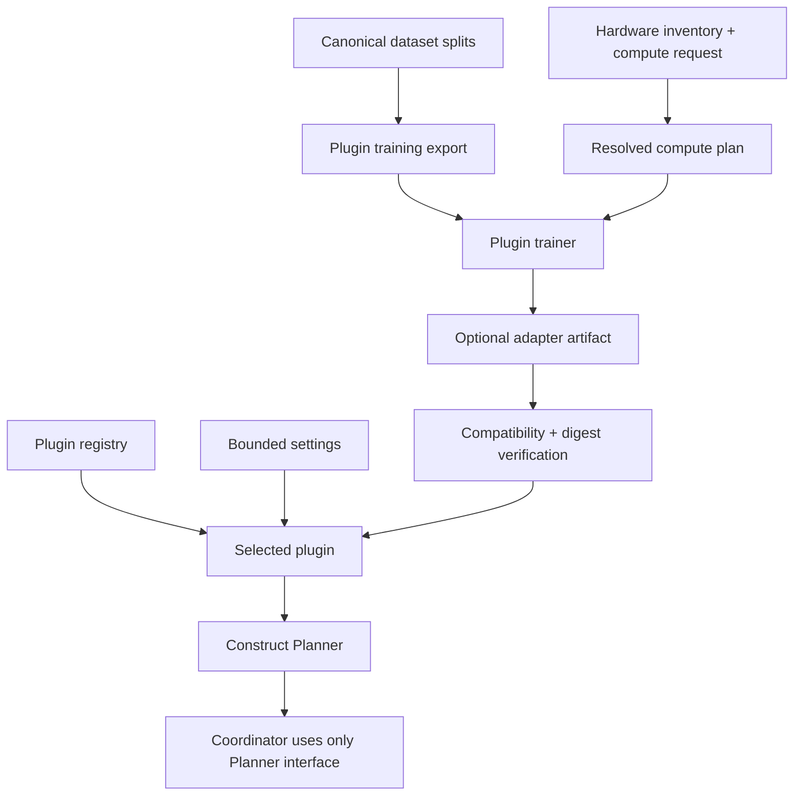

# Model Plugins, Artifacts, and Compute

[Documentation home](README.md) | [Glossary](glossary.md)

This page owns the model-plugin interface, saved-adapter compatibility, and compute-plan
selection. It explains how models remain replaceable without putting model-family code in the
coordinator or executor.

## The short version

The runtime understands a typed planner, not FunctionGemma, Hugging Face, or Low-Rank Adaptation (LoRA). A model plugin translates between one model family's chat/tool format and the shared Plan Intermediate Representation (Plan IR).

Every model plugin must provide:

- a stable plugin identifier and a versioned compatibility descriptor;
- declared precision, attention, context-length, and training capabilities;
- a factory that returns a typed planner;
- a diagnostic session that reports generation behavior without executing proposals.

A trainable plugin may also provide:

- a model-specific export from the canonical dataset;
- a model-specific trainer invoked by the lab;
- a portable artifact manifest consumed again during inference.

FunctionGemma is the first implementation. Shared lab commands call the plugin interface, while
its tokenizer, prompt format, output parser, data export, and trainer remain isolated in
FunctionGemma-specific modules.

The bounded-task path adds two explicitly selected plugins: `functiongemma-tasks` uses compact
tool calls and a LoRA adapter; `task-classifier` uses character n-grams and trained JSON weights.
Both feed the same trusted task compiler. Their runtime loaders do not import host trainers.
Training implementations share dataset readers rather than importing CLI handlers.

## What is shared and what is isolated

| Shared, model-neutral code | Isolated behind a plugin |
| --- | --- |
| Request, capability, state, policy, and Plan-IR contracts | Chat template and tool-call syntax |
| Strict parser and static validator | Tokenizer and model loader |
| Coordinator, executor, audit, and idempotency | Output parsing errors specific to the model format |
| Canonical dataset records and grouped splits | Supervised fine-tuning export format |
| Evaluation metrics and non-executing doctor | Training recipe and loss mask |
| Artifact and compute contracts | Supported precision, attention, and context length |

This separation matters because adding a better model should improve proposal quality without changing execution authority.

## Where the plugin participates



Plugin selection and artifact verification happen when the planner is constructed, before a
request enters the coordinator. The artifact never connects directly to validation or execution;
it only changes the planner's model behavior.

The edge CLI does not currently load a model plugin. Its `demo` command constructs a
`StaticPlanner`. The lab CLI uses plugins for generation exports, training, model diagnosis, and
evaluation. Future applications may use the same registry to compose a production runtime.

## Plugin discovery

The entry-point group is:

```text
edge_delegate.model_plugins.v1
```

An installed Python package registers a stable identifier in its `pyproject.toml`:

```toml
[project.entry-points."edge_delegate.model_plugins.v1"]
my_model = "my_package.edge_delegate_plugin:plugin"
```

`edge-delegate-lab` discovers entry points without loading model weights. Selecting a plugin
loads its Python object and validates the version 1 interface; model weights load only when that
plugin creates a real planner or diagnostic session. The in-repository `functiongemma` plugin is
also available as a source-tree fallback before an editable install is refreshed.

Use:

```bash
edge-delegate-lab models
```

Installing a package is a trust decision because its Python entry point can run code when selected. Plugin discovery is not a sandbox for untrusted packages.

Inference and doctor commands accept `--plugin-settings path/to/settings.json`. The file must be a bounded JSON object with no duplicate keys or non-finite numbers; the selected plugin validates its allowed fields. `--model-id`, `--retrieval-limit`, and `--max-new-tokens` remain convenient explicit overrides for compatible plugins, but they have no generic FunctionGemma defaults.

## Portable model artifact

A completed training run writes `edge-delegate-artifact.json` beside the adapter. The manifest binds:

- plugin Application Programming Interface (API) and package versions;
- exact base-model identifier and resolved revision;
- plan protocol and Plan-IR schema versions;
- saved tokenizer/configuration file paths and SHA-256 fingerprints;
- adapter method, format, file paths, and SHA-256 fingerprints;
- training and validation dataset fingerprints;
- training recipe identifier and version;
- context length and supported precision.

When an adapter is loaded, the plugin checks the manifest, uses its recorded base model unless
the operator explicitly supplies a conflicting one, pins the recorded revision, and verifies
file hashes before creating the planner. Verification checks required coverage as well as
digests: a manifest listing only a configuration file cannot leave the weights unchecked.

Each plugin declares `artifact_contracts` in its `ModelPluginDescriptor`. An `ArtifactContract`
names one supported combination of protocol ID, protocol version, Plan-IR schema, adapter
method, and adapter format, plus the adapter and tokenizer files that must have hashes.
The shared verifier checks those declarations; it does not contain model-family filenames.
An empty declaration means the plugin has not opted into loading manifest-bearing artifacts.

FunctionGemma currently supports `functiongemma-submit-plan` version `1`, `plan-ir.v0`, and
LoRA adapters in `peft` format. It requires hashes for `adapter_config.json`,
`adapter_model.safetensors`, `tokenizer.json`, and `tokenizer_config.json`. Additional listed
files, such as `chat_template.jinja`, are also verified. The inference backend currently loads
the processor from the pinned base-model revision, not from the saved tokenizer directory.

Both `artifact-verify` and the FunctionGemma loader call
`manifest.verify_files(root, descriptor=plugin.descriptor)`. This rejects incompatible protocol
versions/schemas, unsupported adapter layouts, missing required hashes/files, and changed file
contents. Package versions remain recorded provenance: a compatible plugin update does not
have to match the training-time package version exactly. These hashes detect inconsistency;
they are not a signature proving an artifact came from a trusted publisher.

Verify an artifact without loading model weights:

```bash
edge-delegate-lab artifact-verify \
  --artifact artifacts/training/functiongemma-pilot-v0/final-adapter
```

Legacy adapter directories without a manifest are temporarily accepted by the FunctionGemma
plugin for compatibility. New artifacts should always contain the manifest. Set
`allow_legacy_artifact` to `false` in plugin settings when testing a strict deployment path.

The compact and classifier plugins require manifests. Compact artifacts declare
`functiongemma-task` version `1`; classifier artifacts declare `bounded-task` version `1` and
hash both weights and feature metadata. They cannot be loaded as legacy full-plan artifacts.

## Inference context budget

Before generation, the FunctionGemma backend tokenizes the complete prompt, including the
capability cards and tool definition. It requires **prompt tokens + reserved output tokens**
to fit within the context limit. That limit is the smallest of the plugin limit (currently
2,048), the artifact's declared context length when present, and the loaded model's context
limit when available.

An oversized request fails before device transfer or generation; nothing is silently truncated.
Shorten the request, reduce `--retrieval-limit`, or reduce `--max-new-tokens`. A smaller output
budget can still produce an incomplete plan, which the parser rejects. This guard bounds the
context, but does not guarantee that every model configuration fits available GPU memory.

## Compute selection

### Faster resident inference (experimental)

The compact model can spend most of a request generating its short task decision, even though
device transport takes only milliseconds. Two opt-in configurations reduce that inference
overhead without changing the task protocol or bypassing validation:

| Settings file under `configs/inference/` | What changes | Main trade-off |
| --- | --- | --- |
| `functiongemma-tasks-merged.json` | Merge the trained LoRA weights into the resident base model | Floating-point rounding can change predictions; evaluate the merged model separately. |
| `functiongemma-tasks-compiled.json` | Merge, use a fixed-capacity attention cache, and compile decoding | CUDA only; compilation costs startup time and additional memory. |

The saved adapter is never rewritten. Both flags default to `false`, so existing commands keep
the unmerged path. Compiled decoding with an unmerged adapter is rejected. These are model-plugin
settings, not branches in the coordinator or device executor. The implementation follows the
documented [PEFT merge API](https://huggingface.co/docs/peft/en/package_reference/lora) and
[Transformers static-cache compilation](https://huggingface.co/docs/transformers/main/llm_optims).

Add this flag to the managed `run` command in [gateway usage](gateway-preview.md):

```bash
--plugin-settings configs/inference/functiongemma-tasks-compiled.json
```

The gateway loads once, then calls the plugin's optional `WarmableModelSession.warmup()` before
announcing planner readiness. Warm-up only generates example decisions; it never invokes devices.
Expect tens of seconds or more on first compilation. Warm requests reuse compiled decoding and
a cache sized to the context budget, preventing cache resizing for ordinary request-length
changes. Different batch sizes, software versions, devices, or shapes can still compile again.
This is not a hard real-time deadline. Other preview/evaluation commands can compile on their
first generation; their startup behavior is not a gateway readiness guarantee.

Resident inference still uses the original flow: model decision, deterministic task compiler,
full plan validation, fresh execution checks, durable journal, device acknowledgement. No query
answer cache or exact-phrase shortcut replaces the model. Do not share a mutable model session
across concurrent callers without synchronization; the current execution client is sequential.

To reproduce a sequential baseline/candidate comparison on this machine:

```bash
HF_HUB_OFFLINE=1 python scripts/compare_inference.py \
  --artifact artifacts/training/functiongemma-tasks-v1-r2-b16/selected-adapter \
  --candidate-settings configs/inference/functiongemma-tasks-compiled.json \
  --validation data/generated/tasks-v1-r2/validation.jsonl \
  --output artifacts/performance/compiled-decode-new-run
```

Choose a new output directory. The script verifies the canonical validation fingerprint against
its manifest, evaluates 600 validation cases for this dataset, then measures five warmups and
200 requests per run across three runs for each configuration. Training must not run concurrently.
It records settings, source/artifact identity, hardware/software, loading, preparation, generation
resources, and end-to-end times, retaining errors and abstentions. Evaluation batching is separate
from single-request timing. The timing workload has only six fixed phrases; it is not a broad
language benchmark. Existing compiler caches mean startup timing is not a clean-install cold
start. The script does not train, read frozen test/safety splits, or promote a candidate.

See [qualification status](qualification-status.md) for measurements and remaining quality failures.
Text-to-emulator timing excludes speech recognition and speech synthesis. Neither a sub-second
result nor this optimization establishes state-of-the-art performance, CPU/embedded performance,
or physical-device readiness.

### Versioned numeric policy for bounded tasks

`functiongemma-tasks` and `task-classifier` share the same numeric extraction module. Select
behavior through the model-neutral `numeric_policy` inference setting:

| Setting | Behavior |
| --- | --- |
| Omitted or `legacy.v1` | Preserves the existing extractor, including accepting 1001 and 1.234. Existing artifacts and training recipes keep this default. |
| `decimal.v1` | One standalone ASCII decimal literal in [-1000, 1000], at most two fractional digits; unsupported forms require clarification when the model selects display_number. |

The strict policy accepts optional `+`/`-`, leading decimal points (`.5`, `-.5`), leading zeros,
and one trailing sentence mark (`.`, `!`, `?`). Negative zero becomes positive zero. Range and
precision are checked before conversion to the existing numeric Plan IR type, without rounding
an invalid literal into range. Scientific notation, separators, multiple literals, malformed
signs, number words, attached units/currency, Unicode digits/signs, and arithmetic-like tokens
are not converted. This first strict grammar is deliberately narrow: `Display 12, please` and
parenthesized literals also clarify; `Display 12. Please.` is accepted. Common number/calculation
words anywhere in the request are conservatively rejected, even when they are incidental.

This validates a literal **after task selection**. It is not a general arithmetic parser or a
proof of number-role/intent understanding. A model selecting the wrong task still needs outcome
evaluation. FunctionGemma's selected numeric value must match the checked literal; mismatch
remains an invalid proposal, not an automatically repaired action. A temperature read/display
uses the sensor result and is not governed by the explicit-literal range. Device-specific limits
still belong in capability/runtime validation.

To test the new policy automatically on the current compiled FunctionGemma candidate:

```bash
bash scripts/test-latency.sh \
  --settings configs/inference/functiongemma-tasks-compiled-decimal-v1.json
```

That script still covers the six familiar smoke requests. Numeric boundary and rejection
regressions for both plugins, using deterministic model fixtures and the real simulator, run with:

```bash
python -m pytest -q tests/unit/test_numeric_policy.py
```

For other model commands use `--plugin-settings configs/inference/numeric-decimal-v1.json`
with either bounded plugin. The classifier needs its own trained artifact. Do not pass the
FunctionGemma compile settings to it. The legacy full-plan `functiongemma` plugin does not accept
this bounded-task setting.

Session model information reports `numeric_policy`; single-request generation diagnostics also
report `numeric_check` without recording the literal. Reasons distinguish missing/multiple
literals, unsupported expressions/formats, and out-of-range numbers. The existing task/Plan IR
wire format remains unchanged: the resulting route is clarify, with its existing generic
clarification message/reason. New dataset clarification subtypes remain a separate revision.

No artifact files or manifests are rewritten. The version is an **explicit deployment setting**,
not a claim that weights were retrained for this policy. Preserve the settings beside a deployment
and supply them again on restart; without them the artifact uses legacy behavior. Existing evidence
identities include supplied inference settings, so measurements under the two policies are not
interchangeable. Nothing here approves the draft dataset, enables training on v2, or qualifies a
model; any future training/selection recipe must explicitly bind and evaluate its numeric policy.

### Training compute

Compute selection has three inputs:

1. Hardware inventory: logical Central Processing Unit (CPU) cores, system memory, Graphics Processing Unit (GPU), video memory, CUDA runtime, PyTorch version, compute capability, and Brain Floating Point 16-bit (BF16) support.
2. Plugin capabilities: supported precision, attention backend, maximum context, gradient checkpointing, quantized training, and Parameter-Efficient Fine-Tuning (PEFT).
3. Run request: effective batch, context length, requested precision and attention backend, checkpointing choice, and maximum video-memory fraction.

The resolver produces a machine-readable compute plan before model weights are loaded. The current policy is deliberately conservative:

- use CUDA when a compatible GPU is present;
- prefer BF16 when both hardware and plugin support it, otherwise use a declared fallback;
- keep the training microbatch at one and preserve the requested effective batch through gradient accumulation;
- cap the PyTorch process at the configured fraction of GPU memory;
- use at most two data-loading workers on the current small dataset;
- enable pinned memory only for CUDA;
- reject unsupported context, precision, attention, or checkpointing requests.

Inspect the actual machine and resolved plan with:

```bash
edge-delegate-lab compute-inspect
edge-delegate-lab compute-plan --plugin functiongemma
```

Training reports store the inventory, resolved plan, duration, peak allocated GPU memory, peak reserved GPU memory, and token throughput when the trainer provides it.

The resolver does not yet probe several candidate microbatches, sample GPU utilization/power/temperature, or tune for a latency target. Its `selection_source` says `conservative_default_pending_memory_probe` so reports cannot mistake this baseline for an empirical optimum.

## Adding another model correctly

1. Create a separate package or isolated module implementing `InferenceModelPlugin`.
2. Give it a stable lowercase identifier and declare the Plan protocol it understands. For saved artifacts, add `ArtifactContract` entries covering supported versions, schemas, layouts, and every required loader file; call `verify_files(..., descriptor=self.descriptor)` before loading weights.
3. Translate its native output into a typed `PlanIR`; do not return arbitrary text to the coordinator.
4. Implement a diagnostic session so the shared doctor can record model information, selected capabilities, generation telemetry, and model-specific parse failures.
5. If it is trainable, implement the optional training export and trainer methods. Keep its tokenizer, template, loss masking, and trainer code inside that model's implementation.
6. Register the plugin entry point and add a fake-backend contract test that does not download weights.
7. Generate its training export, run preflight, produce a manifest-bearing artifact, and evaluate it on the same frozen canonical records.
8. Only compare deployment candidates after measuring package size, latency, memory, energy, and quality on each declared edge target.

Do not copy FunctionGemma's template or parser into shared code. A second model should share contracts and evaluation records, not model-family assumptions.

[Previous: Contracts and safety](contracts-and-safety.md) | [Next: Model lifecycle](model-lifecycle.md)
