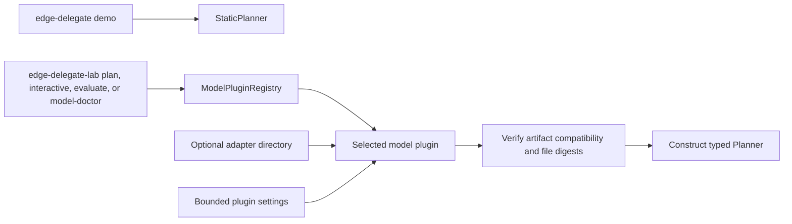
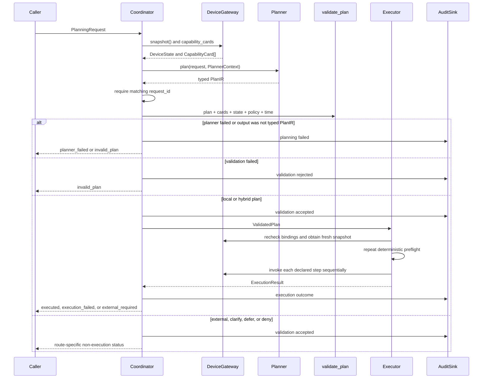

# System Architecture

[Documentation home](README.md) | [Glossary](glossary.md)

This page follows the code that exists today. It separates request-time behavior from model
setup and training so it is clear which component runs when and which component has authority.

## The architecture in one sentence

The coordinator asks a replaceable planner for typed Plan IR, validates that plan against a
device snapshot and policy, and gives only a validated plan to the executor.

The planner can be a model, but the planner cannot authorize or invoke a capability.

## Three boundaries, not one large application

```text
Host lab                           Model integration                  Edge runtime
-------------------------------    -------------------------------    ---------------------------
generate data                      discover selected plugin           receive request
resolve training compute           verify optional adapter            obtain device context
train adapter                      construct Planner                  call Planner interface
evaluate model                                                        validate typed Plan IR
                                                                        execute valid local steps

src/edge_delegate_lab/             src/edge_delegate/model_plugins/   contracts/, ir/, policy/
shared data/evaluation libraries   model-specific planner/trainer     planner/base.py, runtime/
```

These parts share contracts, but they do not have equal authority:

- The **host lab** is development tooling. It does not belong on the edge execution path.
- A **model plugin** is a factory and translation layer. It creates a planner for a model family.
- The **edge runtime** owns validation, routing, execution, replay protection, and audit.

The plugin is selected before a request is handled. At request time, the coordinator sees only
the model-neutral `Planner` interface.

The source tree also contains model-neutral `edge_delegate.data` and
`edge_delegate.evaluation` libraries. They are composed by the host lab and are not imported by
`edge_delegate.runtime`. Likewise, the simulator implements the runtime's `DeviceGateway` port;
the runtime does not import the simulator.

## Setup happens before request handling

There are currently two ways a planner is constructed:



The runtime CLI demo uses `StaticPlanner`, so it exercises coordination and execution without a
model. The lab uses the plugin registry for real-model evaluation. A production application can
compose the same runtime ports and planner interface, but that service wiring is not implemented
in the CLI yet.

For the built-in FunctionGemma plugin, construction may load a base model and optional Low-Rank
Adaptation (LoRA) adapter. If the adapter has `edge-delegate-artifact.json`, the plugin verifies
its model ID, revision, protocol, plugin version, tokenizer files, and adapter files before
returning a planner.

## The actual request path

This is the path implemented by `Coordinator.handle`:



The executor does more than trust an old Boolean result. `ValidatedPlan` is bound to fingerprints
of the exact plan, capability set, policy, and state snapshot. Before invoking anything, the
executor checks the active capability/policy binding and validates again against a fresh device
snapshot. Only then can it call `DeviceGateway.invoke`.

## What happens inside the FunctionGemma planner

The coordinator does not know any of these model-specific details:

```mermaid
flowchart LR
    Input[Request + PlannerContext] --> Retrieval[Policy-filtered BM25 capability selection]
    Retrieval --> Prompt[Versioned messages + one submit_plan tool]
    Prompt --> Backend[FunctionGemma base model + optional adapter]
    Backend --> Text[Generated text]
    Text --> Wrapper[Require the exact submit_plan wrapper]
    Wrapper --> Parser[Strict Plan-IR parser]
    Parser --> Typed[Typed PlanIR returned to Coordinator]
```



Best Matching 25 (BM25) selection reduces prompt size; it does not grant access. The validator
checks every proposed capability against the complete active capability set and policy.

The model receives only the synthetic `submit_plan(plan_json)` tool. It does not receive the
real sensor and actuator functions. Requiring one complete plan lets deterministic code inspect
dependencies, permissions, approvals, side effects, and total resource cost before the first
device action.

## Route behavior implemented today

| Valid plan route | Steps allowed | Coordinator result | Device invocation |
| --- | --- | --- | --- |
| `local` | One or more local steps | `executed` or `execution_failed` | Yes, through the executor |
| `hybrid` | One or more local steps | Local steps run, then `external_required` | Local steps only |
| `external` | No steps | `external_required` | No |
| `clarify` | No steps; clarification text required | `clarification_required` | No |
| `defer` | No steps; reason code required | `deferred` | No |
| `deny` | No steps; reason code required | `denied` | No |

`external_required` is a status, not an external-model call. The `connectors/` modules are
placeholders. The `ExternalHandoff` contract exists, but the coordinator does not yet construct
or transmit one.

## Component authority and code ownership

| Component | Code | May do | Must not do |
| --- | --- | --- | --- |
| Contracts | `src/edge_delegate/contracts/` | Decode bounded values into typed objects | Infer policy or execute work |
| Planner interface | `planner/base.py` | Accept request/context and return `PlanIR` | Invoke device capabilities |
| FunctionGemma planner | `planner/functiongemma.py` | Select prompt cards, generate, strictly parse | Relax runtime validation |
| Model plugin | `model_plugins/` | Verify artifacts and construct a planner/diagnostic session | Become an execution authority |
| Static validator | `ir/static_check.py` | Check plan shape, capabilities, state, policy, approvals, and budgets | Invoke capabilities |
| Coordinator | `runtime/coordinator.py` | Gather context, call planner, validate, route, and audit | Execute raw planner output |
| Executor | `runtime/executor.py` | Recheck a `ValidatedPlan` and invoke declared local steps | Accept text or an unvalidated plan |
| Runtime ports | `runtime/ports.py` | Define device, clock, audit, and idempotency interfaces | Depend on simulator or lab code |
| Simulator | `simulator/` | Implement `DeviceGateway` deterministically for tests | Claim to be production hardware |
| Host lab | `edge_delegate_lab/` | Generate data, train, inspect compute, and evaluate | Be imported by the edge runtime |

## Why there are two command-line programs

The separation is deliberate and tested:

| Program | Commands | Intended environment |
| --- | --- | --- |
| `edge-delegate` | `demo`, `validate` | Small runtime/edge environment; no ML dependency required |
| `edge-delegate-lab` | `generate-data`, `models`, `compute-inspect`, `compute-plan`, `train`, `artifact-verify`, `plan`, `interactive`, `model-doctor`, `evaluate` | Development host with optional model/training packages |

`tests/architecture/test_dependencies.py` rejects runtime imports of the simulator, model
plugins, datasets, evaluation code, connectors, or lab package. `tests/unit/test_cli_boundaries.py`
keeps model and training commands out of the edge CLI.

## Dependency direction

The intended source dependency direction is:

```text
contracts
  <- policy, Plan IR, retrieval, runtime ports
  <- planner implementations, simulator, runtime coordinator/executor
  <- model plugins and evaluation
  <- host lab and model-specific training
```

Optional packages such as PyTorch, Transformers, PEFT, TRL, and Datasets are imported only on
model inference or training paths. Importing and using the deterministic runtime does not require
them.

## Implemented versus planned

| Boundary | Implemented | Still planned |
| --- | --- | --- |
| Device | `DeviceGateway` protocol and deterministic simulator | Physical hardware adapters, persistent stores, real timeout/cancellation, recovery after partial physical failure |
| Planner | Static planner, strict FunctionGemma planner, scripted backend | More real model plugins and a production request service |
| Local execution | Sequential execution, reference resolution, revalidation, idempotency | Target-specific concurrency or compensation semantics, if ever required |
| External work | Route validation, `external_required` status, handoff data type | Redaction pipeline, connector, response contract, response validation, provenance, timeout/cancellation |
| Model lifecycle | Data generation, plugin export, preflight, LoRA training, artifact verification, non-executing query client, model doctor, evaluator | Deployment-quality dataset, embedded export, frozen representative device benchmarks |

The code should be changed before a document claims that a planned boundary is implemented.

[Previous: Documentation home](README.md) | [Next: Contracts and safety](contracts-and-safety.md)
